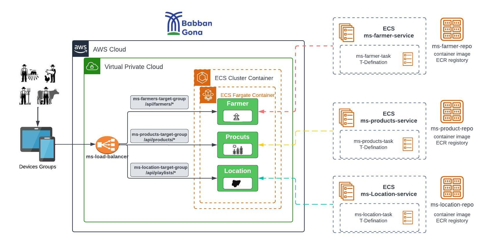
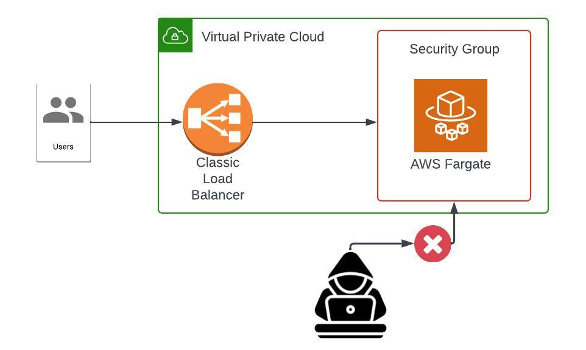

# Farming App Deployment on AWS ECS

This project demonstrates the deployment of a farming application using AWS ECS (Elastic Container Service). The application comprises three microservices: farmers, products, and locations. Each microservice is deployed as a containerized application on AWS ECS for scalability, reliability, and ease of management.

## Architecture



## Technologies Used:
-   Docker
-   ECR
-   AWS ECS (Elastic Container Service)
-   AWS Fargate
-   AWS CLI
-   Bash Script


## Prerequisites : Must have:
- An AWS account with appropriate permissions to create ECS clusters, services, and tasks.
- Docker installed on your local machine.
- AWS CLI installed and configured with appropriate credentials.

## Prerequisites : Optional:
- Set VPN Network comprices of vpn, subnets, route and route tables, natgatway, internet gateway ...
- Loadbalancer with default target group
- Security Group for ECS and Loadbalancer to limit access to application
- ECS cluster "this usualy take about 5-10mins to provision"



### | Rule Description                                    | Type          | Protocol  | Port Range | Source / Destination                     |
|-----------------------------------------------------|---------------|-----------|------------|-----------------------------------------|
| Allow HTTP traffic to load balancer (Inbound)      | HTTP (80)     | TCP       | 80         | 0.0.0.0/0 (Anywhere)                    |
| Allow traffic from load balancer to ECS Fargate    | Custom TCP    | TCP       | Custom     | Security Group ID of Load Balancer      |


## Deployment Steps:

### 1. Dockerize Microservices:
- Clone the repository containing the source code for each microservice  under aws-console folder (music, user, playlist).
- Dockerize each microservice and spin up locally to test.
    ```shell
        ## cd to aws-conosle directory and run 
        docker compose up ## to spin up all the microservice under the directory
        ## curl http://localhost:3000/api/farmers - farmers service
        ## curl http://localhost:3001/api/locations - locatios service
        ## curl http://localhost:3002/api/products - products playlists
    ```
- Build Docker images for each microservice using the `docker build` command.
    ```shell
        docker build -t image-name-here . ## to build the image and tag it
    ```

### 2a. Push Docker Images to AWS ECR (Elastic Container Registry) Method 1:
- Create an ECR repository for each microservice in the AWS Management Console.
- Tag the Docker images with the ECR repository URI.
- Push the Docker images to ECR using the `docker push` command.
- Apply same for all services

#### 2b. Push Docker Images to Amazon ECR using script file Method 2:
This guide explains how to push Docker images to Amazon ECR using a script.
- Ensure you have this structure below
.
├── README.md
├── architecture.jpeg
├── docker-compose.yml
├── ecr_repositories.txt
├── farmers
│ ├── Dockerfile
│ ├── db.json
│ ├── package.json
│ └── server.js
├── locations
│ ├── Dockerfile
│ ├── db.json
│ ├── package.json
│ └── server.js
├── products
│ ├── Dockerfile
│ ├── db.json
│ ├── package.json
│ └── server.js
├── push_ecr.sh
└── security.jpeg
- Review ecr_repositories.txt for instructions
- Run the code below to push all images to ecr
``` bash
## Permission and Script Execution
## Ensure the script is executable:
chmod +x push_ecr.sh

# Script execution
./push_ecr.sh
```


### 3. Configure AWS ECS Cluster:
- Create an ECS cluster in the AWS Management Console or using AWS CLI.
- Define the cluster capacity, networking configuration, and security groups as per your requirements.
- Ensure that the ECS cluster is configured to use Fargate launch type for serverless container deployments.

### 4. Create ECS Task Definitions:
- Define task definitions for each microservice specifying the Docker image URI, CPU/memory requirements, port mappings, and environment variables.
- Create ECS task definitions either through the AWS Management Console or using AWS CLI.

### 5. Create ECS Services:
- Create ECS services for each microservice based on the previously defined task definitions.
- Configure the desired number of tasks, service discovery, and load balancing settings.
- Associate the services with the ECS cluster.
- Configure network, loadbalancer and target group for ther servise

### 6. Testing and Monitoring:
- Verify that the ECS services are running successfully by accessing the application endpoints.
- Monitor the ECS cluster, services, and tasks using AWS CloudWatch and ECS dashboard.
- Implement logging and monitoring solutions for better visibility into the application's performance and health.

## Conclusion:
By following these deployment steps, you can successfully deploy a greate farming applcataion consisting of multiple microservices on AWS ECS. Utilizing containerization with Docker and orchestration with ECS ensures scalability, reliability, and efficient resource utilization for your application.

## Production Ready Environment
- Automation deployment using Github Action or Jenkin
- IAC using terraform 
- Kubernetes as alternative
- Secret Manager for database secret variable
- Monitoring and Logging using Grafana, loki, grafana, or Newrelic

## Additional Resources:
- [AWS ECS Documentation](https://docs.aws.amazon.com/ecs/)
- [Docker Documentation](https://docs.docker.com/)
- [AWS CLI Documentation](https://awscli.amazonaws.com/v2/documentation/api/latest/index.html)
